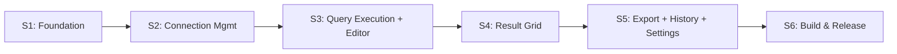

# Zentro — Implementation Plan

> **Version**: MVP 0.1.0  
> **Stack**: Go 1.22+ · Fyne v2 · PostgreSQL (pgx/v5) · MSSQL (go-mssqldb)  
> **Target**: Startup < 1s · RAM idle < 100MB · Binary < 30MB · Windows + macOS

---

## Cách dùng document này

- **Trước mỗi sprint**: đọc phần sprint đó + các skill files được reference
- **Trước khi tạo file Go**: đọc `skills/01-project-architecture/SKILL.md` để check dependency rules
- **Khi hoàn thành task**: tick checkbox acceptance criteria để track progress
- **Khi bắt đầu session mới**: đọc file này trước để biết đang ở sprint nào

---

## Workflow Phát Triển

### 1. Quy trình tạo một feature

```
Đọc spec → Đọc skill tương ứng → Tạo file backend (db/) trước → 
Tạo models nếu cần → Tạo UI widget → Wire vào main.go → 
Smoke test thủ công → Tick acceptance criteria
```

### 2. Thứ tự tạo file trong một sprint (luôn theo thứ tự này)

```
1. models/     ← không phụ thuộc gì, tạo trước nhất
2. utils/      ← chỉ cần models + stdlib
3. db/         ← cần models, không cần ui
4. ui/         ← cần models + db
5. main.go     ← wire tất cả lại
```

### 3. Quy tắc không vi phạm

- `db/` không bao giờ import `ui/` — sẽ tạo circular import
- Không dùng `global var` để share state — dùng `AppState` struct và inject
- Tất cả UI updates từ goroutine: `widget.SetText()` OK, `container.Add()` phải `fyne.Do()`
- `app.NewWithID("io.zentro.app")` — không được dùng `app.New()`

### 4. Smoke test sau mỗi sprint

```bash
go build ./...          # phải pass không lỗi
go vet ./...            # phải pass không warning
go run ./cmd/zentro/    # chạy thủ công kiểm tra acceptance criteria
```

---

## Sprint Overview

| Sprint | Tuần | Focus | Status |
|---|---|---|---|
| [S1](#sprint-1--foundation-tuần-1) | 1 | Foundation — project boots | ✅ Done |
| [S2](#sprint-2--connection-management-tuần-23) | 2–3 | Connection Management | ✅ Done |
| [S3](#sprint-3--query-execution--multi-tab-editor-tuần-46) | 4–6 | Query Execution + Editor | ⬜ Todo |
| [S4](#sprint-4--result-grid-tuần-79) | 7–9 | Result Grid + Batch Edit | ⬜ Todo |
| [S5](#sprint-5--polish--secondary-features-tuần-1011) | 10–11 | Export, History, Settings | ⬜ Todo |
| [S6](#sprint-6--build--release-tuần-1213) | 12–13 | Cross-Platform Build | ⬜ Todo |

> Cập nhật status: ⬜ Todo → 🔄 In Progress → ✅ Done

---

## Sprint 1 — Foundation (Tuần 1)

> [!IMPORTANT]
> Sprint này tạo skeleton mà mọi sprint sau phụ thuộc vào. Phải hoàn thành 100% trước khi sang S2.

**Skill refs**: [01-project-architecture](skills/01-project-architecture/SKILL.md) · [06-ui-layout-app-state](skills/06-ui-layout-app-state/SKILL.md) · [09-logging](skills/09-logging/SKILL.md)

### Files cần tạo

| File | Nội dung chính |
|---|---|
| `go.mod` | Module `zentro`, deps: fyne/v2, pgx/v5/stdlib, go-mssqldb |
| `internal/models/connection.go` | `ConnectionProfile` struct |
| `internal/models/query.go` | `QueryResult`, `HistoryEntry` structs |
| `internal/utils/logger.go` | `NewLogger(logToFile bool) *slog.Logger` |
| `internal/utils/prefs.go` | `Pref*` constants + `SaveConnections`, `LoadConnections`, `ApplyPreferences` |
| `internal/ui/mainwindow.go` | `AppState`, `BuildMainWindow`, `buildToolbar`, `buildStatusBar` |
| `cmd/zentro/main.go` | Entry point — init AppState, gọi BuildMainWindow, ShowAndRun |

### Tasks

```
1. Tạo go.mod + go get các dependencies
2. models/connection.go — ConnectionProfile struct (all fields)
3. models/query.go — QueryResult + HistoryEntry structs
4. utils/logger.go — NewLogger + MultiHandler
5. utils/prefs.go — Pref* constants + Save/Load stubs (json + base64)
6. ui/mainwindow.go:
   a. AppState struct (App, MainWindow, CurrentDB, ActiveProfile, Logger, ...)
   b. buildStatusBar() → "Not connected" + "Ready"
   c. buildToolbar() → tất cả buttons disabled trừ "New Connection"
   d. BuildMainWindow() → container.NewBorder(toolbar, statusBar, nil, nil, placeholder)
7. main.go:
   a. app.NewWithID("io.zentro.app")
   b. Khởi tạo AppState{App, Logger}
   c. LoadConnections → gán vào state
   d. BuildMainWindow(state)
   e. w.ShowAndRun()
```

### Acceptance Criteria

- [ ] `go build ./...` không lỗi
- [ ] `go run ./cmd/zentro/` mở window 1280×800
- [ ] Toolbar hiển thị đúng buttons (tất cả disabled trừ "New Connection")
- [ ] Status bar hiển thị "Not connected" và "Ready"
- [ ] Logger ghi ra stderr khi start

---

## Sprint 2 — Connection Management (Tuần 2–3)

**Skill refs**: [02-connection-management](skills/02-connection-management/SKILL.md)

### Files cần tạo

| File | Nội dung chính |
|---|---|
| `internal/db/connector.go` | `BuildConnectionString`, `OpenConnection`, `TestConnection` |
| `internal/ui/connection/dialog.go` | `ShowConnectionDialog` — form, validation, test conn button |
| `internal/ui/connection/list.go` | `NewConnectionListWidget` — list, connect, edit, delete |

### Tasks

```
1. db/connector.go:
   a. BuildConnectionString (postgres DSN + sqlserver DSN)
   b. OpenConnection (*sql.DB + SetMaxOpenConns/IdleConns/ConnMaxLifetime)
   c. TestConnection (PingContext 10s timeout → trả error thân thiện)

2. ui/connection/dialog.go:
   a. ShowConnectionDialog(parent, existing, onSave)
   b. widget.Form với tất cả fields từ ConnectionProfile
   c. Driver select onChange: đổi Port default + toggle SSLMode visibility
   d. "Test Connection" button → goroutine → TestConnection → dialog.NewInformation
   e. Validation trước khi gọi onSave

3. utils/prefs.go (hoàn thiện):
   a. SaveConnections: base64 password + json.Marshal + Preferences.SetString
   b. LoadConnections: Preferences.StringWithFallback + json.Unmarshal + base64 decode

4. ui/connection/list.go:
   a. NewConnectionListWidget(profiles, onConnect, onEdit, onDelete)
   b. widget.List hiển thị "[driver] name — host:port"
   c. OnSelected → connect action
   d. Delete với dialog.NewConfirm

5. Wire vào main.go + mainwindow.go:
   a. "New Connection" button → ShowConnectionDialog(nil)
   b. onSave → append + SaveConnections + refresh list
   c. onConnect → OpenConnection → AppState.OnConnectionChanged()
   d. OnConnectionChanged: enable "New Query", update status bar
```

### Acceptance Criteria

- [ ] Tạo connection profile → persist sau khi restart app
- [ ] Edit profile → thay đổi đúng field
- [ ] Xóa profile → có confirm dialog
- [ ] Driver switch → Port default thay đổi đúng (5432 ↔ 1433)
- [ ] "Test Connection" thành công → "Connected!" dialog
- [ ] "Test Connection" thất bại → hiển thị error message chi tiết
- [ ] Kết nối thành công → "New Query" button enabled
- [ ] Status bar: "⬤ profile_name (postgres @ localhost:5432)"
- [ ] Validation: required fields, port range, unique name

---

## Sprint 3 — Query Execution & Multi-Tab Editor (Tuần 4–6)

**Skill refs**: [03-async-query-execution](skills/03-async-query-execution/SKILL.md) · [04-multi-tab-editor](skills/04-multi-tab-editor/SKILL.md)

### Files cần tạo

| File | Nội dung chính |
|---|---|
| `internal/db/executor.go` | `IsSelectQuery`, `injectLimitIfMissing`, `streamRows`, `ExecuteQuery` |
| `internal/ui/editor/tab_state.go` | `TabState` struct |
| `internal/ui/editor/editor_widget.go` | `QueryEditorWidget` — DocTabs management |
| `internal/ui/editor/tab_content.go` | `buildTabContent` — editor + VSplit layout |

### Tasks

```
1. db/executor.go:
   a. IsSelectQuery (strings.TrimSpace + HasPrefix check)
   b. injectLimitIfMissing (regex \bLIMIT\b|\bTOP\b)
   c. streamRows (rows.Next loop, pointer scan vào []interface{})
   d. ExecuteQuery → chan *QueryResult (goroutine, defer close)

2. ui/editor/tab_state.go:
   — TabState struct (ID, Title, QueryText, LastResult, DB, ProfileName, CancelFunc, Modified)

3. ui/editor/tab_content.go:
   a. buildTabContent(tab, state, onRun):
      - widget.NewMultiLineEntry + placeholder text
      - editor.OnChanged → update state.QueryText + state.Modified
      - container.NewVSplit(editor, placeholder), Offset=0.4

4. ui/editor/editor_widget.go:
   a. QueryEditorWidget struct (DocTabs, tabStates map, onRun callback)
   b. NewQueryEditorWidget(onRun) → init DocTabs
   c. AddTab(profile, db) → tạo TabState + TabItem, fyne.Do(tabs.Append)
   d. CloseTab(tab) → abort CancelFunc + unsaved prompt + fyne.Do(tabs.Remove)
   e. GetCurrentState() → trả TabState của tab đang chọn
   f. SetResult(tab, result) → fyne.Do(update result area)

5. Wire vào mainwindow.go:
   a. Đăng ký Ctrl+Enter shortcut tại window.Canvas()
   b. "Run" button → runQuery(state, tabState)
   c. runQuery():
      - OnQueryStarted() (disable Run, enable Cancel, status "Running...")
      - goroutine: ExecuteQuery → <-ch
      - AppendHistory (goroutine background)
      - OnQueryFinished() (enable Run, disable Cancel, update status)
      - editor.SetResult(tab, result)
   d. "Cancel" → tabState.CancelFunc()
   e. "New Query" → editor.AddTab(activeProfile, currentDB)
```

### Acceptance Criteria

- [ ] Mở nhiều tab độc lập
- [ ] Editor mỗi tab lưu text riêng
- [ ] Ctrl+Enter trigger run query của tab hiện tại
- [ ] Run button trigger query
- [ ] Status bar "Running..." khi query đang chạy
- [ ] Status bar hiển thị duration + row count sau khi xong
- [ ] Cancel button abort query đang chạy
- [ ] Error SQL → hiển thị error dialog
- [ ] Close tab có text chưa run → confirm prompt
- [ ] SELECT result placeholder thay bằng result count label

---

## Sprint 4 — Result Grid (Tuần 7–9)

**Skill refs**: [05-result-grid](skills/05-result-grid/SKILL.md)

### Files cần tạo

| File | Nội dung chính |
|---|---|
| `internal/utils/format.go` | `FormatCellValue` — NULL, []byte, time.Time, bool |
| `internal/ui/result/table_widget.go` | `ResultTableWidget`, `buildTable`, `UpdateData`, `Clear` |
| `internal/ui/result/selection.go` | `handleCellTap`, `getSelectedInColumn` |
| `internal/ui/result/edit.go` | `openEditDialog`, batch edit confirm flow |
| `internal/ui/result/pagination.go` | `pageRows`, `pageInfo`, pagination controls |

### Tasks

```
1. utils/format.go:
   — FormatCellValue: nil→"NULL", []byte→string, time.Time→format, bool→"true"/"false"

2. ui/result/table_widget.go:
   a. ResultTableWidget struct
   b. NewResultTableWidget(parent fyne.Window)
   c. buildTable():
      - widget.NewTable(length, create, update)
      - Row 0 = header (bold labels)
      - UpdateCell dùng FormatCellValue
      - Highlight selected cells (bold style)
      - Highlight edited cells (italic style)
      - OnSelected → handleCellTap
   d. UpdateData(result): reset selection + edited + page + table.Refresh()
   e. Widget() → trả CanvasObject (table hoặc table+pagination)
   f. GetEditedCells() → map[TableCellID]string

3. ui/result/selection.go:
   a. handleCellTap(id): ignore Row 0, toggle r.selected[id]
   b. getSelectedInColumn(col): filter r.selected by col
   c. table.Refresh() sau mỗi thay đổi selection

4. ui/result/edit.go:
   a. openEditDialog(id):
      - Lấy current value (check edited map first)
      - dialog.ShowCustomConfirm với widget.Entry
      - Sau confirm: getSelectedInColumn → nếu > 1 → batch confirm dialog
      - Update r.edited map → table.Refresh()

5. ui/result/pagination.go:
   a. pageRows() → slice theo page + pageSize
   b. pageInfo() → "X–Y of Z"
   c. Pagination controls (Prev/Next buttons + label)
   d. Widget() check: len(data) > pageSize → wrap với pagination

6. Wire vào editor_widget.go:
   — SetResult gọi resultTable.UpdateData() qua fyne.Do
   — Export button gọi resultTable.GetEditedCells() → ExportToCSV
```

### Acceptance Criteria

- [ ] SELECT result hiển thị đúng columns và data
- [ ] NULL → "NULL", time.Time → đúng format, []byte → string
- [ ] Click cell → highlight (bold)
- [ ] Double-click → edit dialog với current value
- [ ] Single edit: chỉ update cell đó
- [ ] Batch edit: confirm → apply cho tất cả selected cells cùng cột
- [ ] Edited cells hiển thị italic
- [ ] Pagination xuất hiện khi > 5000 rows, Prev/Next hoạt động đúng
- [ ] `table.Refresh()` không giật lag với 1000 rows

---

## Sprint 5 — Polish & Secondary Features (Tuần 10–11)

**Skill refs**: [07-export-and-history](skills/07-export-and-history/SKILL.md) · [08-preferences-settings](skills/08-preferences-settings/SKILL.md)

### Files cần tạo

| File | Nội dung chính |
|---|---|
| `internal/utils/export.go` | `ExportToCSV` (merge với edited cells) |
| `internal/db/history.go` | `AppendHistory`, `LoadHistory`, `ClearHistory` |
| `internal/ui/history/panel.go` | `NewHistoryPanel` — widget.List + clear |
| `internal/ui/settings/dialog.go` | `ShowSettingsDialog` — theme + row limit |

### Tasks

```
Export CSV:
1. utils/export.go:
   — ExportToCSV(result, editedCells, filePath): csv.NewWriter, header, rows với edited override
2. "Export" button:
   — dialog.NewFileSave + .SetFilter(.csv)
   — goroutine → ExportToCSV → dialog completion

Query History:
3. db/history.go:
   — AppendHistory: prepend + trim 200 + json + Preferences.SetString
   — LoadHistory: Preferences.StringWithFallback + json.Unmarshal
   — ClearHistory: Preferences.SetString("[]")
4. Gọi AppendHistory sau mỗi ExecuteQuery (trong goroutine background)
5. ui/history/panel.go:
   — widget.List hiển thị: "[profile] HH:MM:SS — query preview..."
   — OnSelected → paste query vào GetCurrentState().QueryText
   — Clear button + dialog.NewConfirm

Settings:
6. ui/settings/dialog.go:
   — ShowSettingsDialog: widget.Form với themeSelect + limitEntry
   — Confirm → applyTheme + SetDefaultLimit
7. ApplyPreferences gọi tại startup trong main.go
8. Settings button trong toolbar

Tích hợp history limit vào ExecuteQuery:
9. executor.go: đọc utils.GetDefaultLimit thay vì hardcode 1000
```

### Acceptance Criteria

- [ ] Export CSV tạo ra file đúng headers + data
- [ ] Edited cells được reflect trong CSV export
- [ ] History lưu tối đa 200 entries
- [ ] History persist qua app restart
- [ ] Click history entry → query paste vào tab active
- [ ] Clear history → confirm dialog → list trống
- [ ] Theme switch (light/dark/system) apply ngay không cần restart
- [ ] Default row limit thay đổi → apply cho lần query sau

---

## Sprint 6 — Build & Release (Tuần 12–13)

**Skill refs**: [10-cross-platform-build](skills/10-cross-platform-build/SKILL.md)

### Tasks

```
1. Tạo assets/icon.png (512×512)
2. fyne bundle -o cmd/zentro/bundled.go assets/icon.png
3. app.SetIcon(resourceIconPng) trong main.go

Release builds:
4. Windows:
   go build -ldflags="-s -w -H windowsgui" -o zentro.exe ./cmd/zentro/
5. macOS (arm64 + amd64 → universal):
   GOARCH=arm64 go build -ldflags="-s -w" -o zentro-arm64 ./cmd/zentro/
   GOARCH=amd64 go build -ldflags="-s -w" -o zentro-amd64 ./cmd/zentro/
   lipo -create -output zentro zentro-arm64 zentro-amd64
6. fyne package (optional, cho app bundle đẹp hơn)

QA:
7. Đo startup time (cold start)
8. Đo RAM idle sau 30s
9. Kiểm tra binary size
10. Smoke test: connect DB, run query, edit cell, export CSV, check history
11. git tag v0.1.0 + git push
```

### Acceptance Criteria

- [ ] `go build ./...` clean trên Windows
- [ ] Windows .exe < 30MB, startup < 1s, không có console window
- [ ] macOS binary < 30MB, startup < 1s
- [ ] RAM idle < 100MB (đo bằng Task Manager / Activity Monitor)
- [ ] App icon đúng trên taskbar/dock
- [ ] Toàn bộ acceptance criteria của S1–S5 đã pass

---

## File Map Tổng Thể

```
zentro/
├── cmd/zentro/
│   ├── main.go                              [S1]
│   └── bundled.go                           [S6] ← fyne bundle output
├── internal/
│   ├── models/
│   │   ├── connection.go                    [S1]
│   │   └── query.go                         [S1]
│   ├── utils/
│   │   ├── logger.go                        [S1]
│   │   ├── prefs.go                         [S1, S5]
│   │   ├── format.go                        [S4]
│   │   └── export.go                        [S5]
│   ├── db/
│   │   ├── connector.go                     [S2]
│   │   ├── executor.go                      [S3]
│   │   └── history.go                       [S5]
│   └── ui/
│       ├── mainwindow.go                    [S1, S2, S3]
│       ├── connection/
│       │   ├── dialog.go                    [S2]
│       │   └── list.go                      [S2]
│       ├── editor/
│       │   ├── tab_state.go                 [S3]
│       │   ├── editor_widget.go             [S3]
│       │   └── tab_content.go              [S3]
│       ├── result/
│       │   ├── table_widget.go              [S4]
│       │   ├── selection.go                 [S4]
│       │   ├── edit.go                      [S4]
│       │   └── pagination.go               [S4]
│       ├── history/
│       │   └── panel.go                     [S5]
│       └── settings/
│           └── dialog.go                    [S5]
├── assets/
│   └── icon.png                             [S6]
├── skills/                                  ← skill definitions
├── specs/                                   ← feature specs
├── IMPLEMENTATION_PLAN.md                   ← file này
├── go.mod
└── go.sum
```

---

## Dependency Graph



---

## Out of Scope — MVP 0.1.0

| Feature | Lý do defer |
|---|---|
| Schema browser (tables/views tree) | Phức tạp, không thiết yếu cho MVP |
| SQL auto-complete / formatter | Cần 3rd party lib hoặc custom engine lớn |
| Commit edits về database | Safety risk, cần transaction UI phức tạp |
| SSH tunnel | Ngoài scope security MVP |
| MySQL / SQLite | Focus PostgreSQL + MSSQL trước |
| ER diagram / visualization | Post-MVP feature set |
| Plugin system | Over-engineered cho MVP |
| Import data | Post-MVP |
