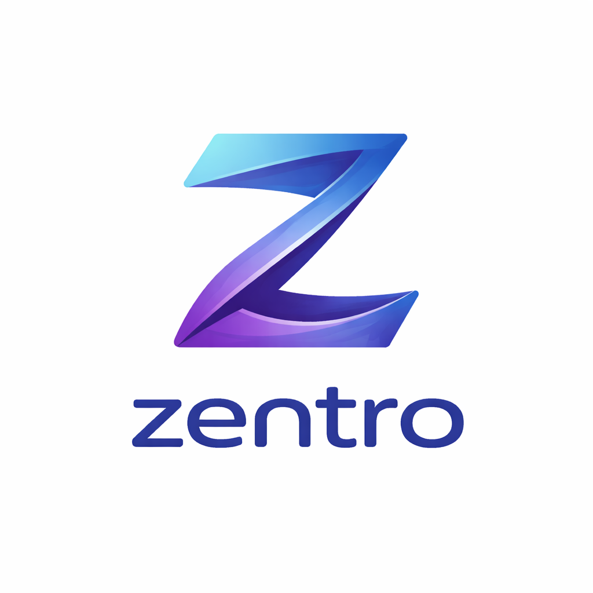
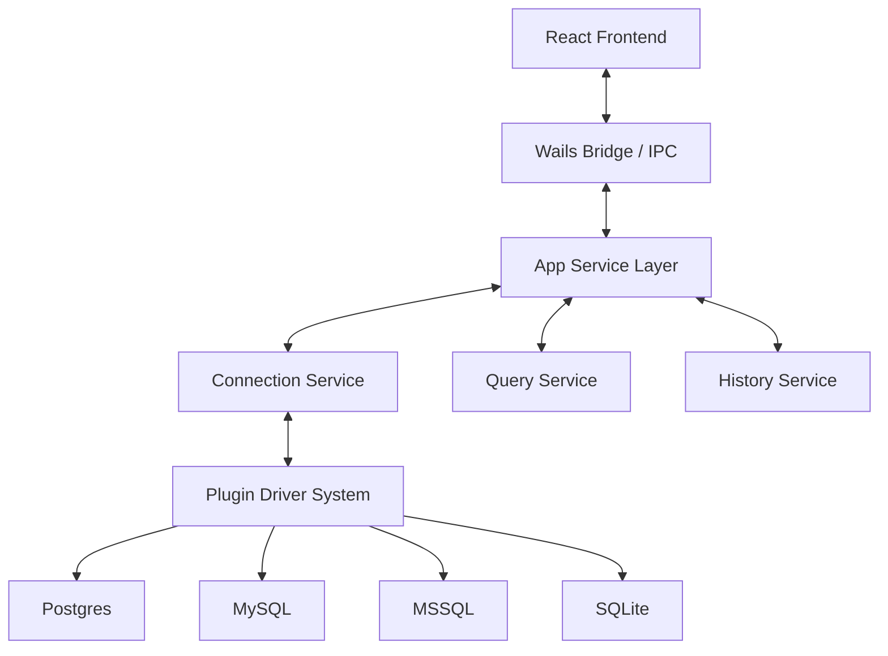

# Zentro



**Zentro** is a high-performance, cross-platform SQL IDE engineered for speed, reliability, and modern developer workflows. Built with a modular Go backend and a sleek React frontend, it provides a unified interface for managing multiple database engines with enterprise-grade features.

## 🚀 Key Features

### 🛠 Core Capabilities
- **Multi-Engine Support**: Seamlessly connect to PostgreSQL, MySQL, MariaDB, Microsoft SQL Server, and SQLite.
- **Advanced Query Engine**: Multi-tab editor with asynchronous execution, real-time query cancellation, and persistable history.
- **Intuitive Schema Browser**: Explore databases, tables, and relationships with ease.
- **ERD Visualization**: Interactive Entity-Relationship Diagrams to understand your data architecture.

### 📊 Data & Schema Engineering
- **Direct Table Editing**: Add, drop, or alter columns directly through the UI.
- **Data Export**: Export results to CSV with support for large datasets.
- **Script Management**: Save and organize frequent SQL scripts and templates.

### 🔒 Enterprise Ready
- **Secure Credentials**: Integrated with OS-level keyrings (Windows Credential Manager, macOS Keychain, Linux Secret Service).
- **Customizable Environment**: Global preferences for themes, font sizes, and execution limits.
- **Cross-Platform DNA**: Identical experience across Windows, macOS, and Linux.

## 🏗 Technology Stack

- **Backend**: [Go 1.25+](https://go.dev/) + [Wails v2](https://wails.io/)
- **Frontend**: [React](https://reactjs.org/), [TypeScript](https://www.typescriptlang.org/), [Vite](https://vitejs.dev/)
- **Styling**: Tailwind CSS / Vanilla CSS
- **Inter-process Communication**: Wails high-speed bridge (Go-JS/TS)

## 📐 Architecture

Zentro follows a clean, modular architecture designed for extensibility.



## 🛠 Getting Started

### Prerequisites
- **Go**: 1.25 or higher
- **Node.js**: 18.x or higher
- **Wails CLI**: Installed via `go install github.com/wailsapp/wails/v2/cmd/wails@latest`

### Development
To run Zentro in live development mode:
```bash
wails dev
```

### Production Build
To create a redistributable package for your current OS:
```bash
wails build
```

## 📂 Project Structure

- `/cmd`: Application entry points.
- `/internal/app`: Wails application logic and service orchestration.
- `/internal/core`: Core abstractions and driver registry.
- `/internal/driver`: Implementation of database-specific drivers.
- `/frontend`: React application source code.
- `/assets`: Static assets and branding.

## 📄 License
This project is licensed under the MIT License - see the [LICENSE](LICENSE) file for details.

