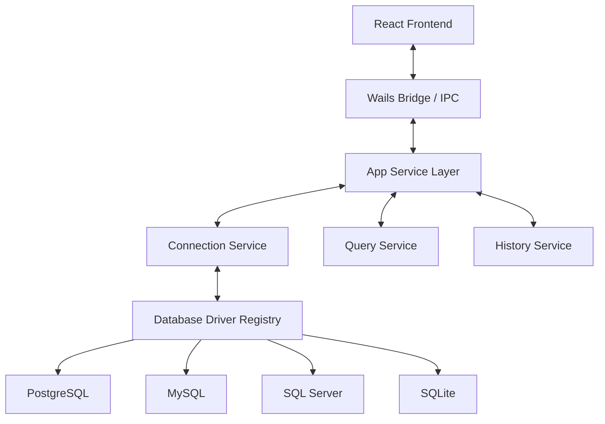

# Zentro


Free cross-platform SQL IDE for developers, data engineers, and database operators.

- Supports PostgreSQL, MySQL, SQL Server, and SQLite out of the box.
- Includes SQL editor, schema explorer, result grid, ERD, saved scripts, and Git tracking.
- Built with Go + Wails backend and React + TypeScript frontend.


## Download

Download the latest prebuilt binaries from [GitHub Releases](https://github.com/alexnguyen03/zentro/releases).

Current stable release: **v0.3.0** (April 26, 2026).  
See [CHANGELOG.md](CHANGELOG.md) for release notes.

## Running

### Prerequisites

- Go `1.25+`
- Node.js `18+`
- Wails CLI:

```bash
go install github.com/wailsapp/wails/v2/cmd/wails@latest
```

### Development Mode

```bash
wails dev
```

### Production Build

```bash
wails build
```

## Documentation

- Product wiki: [Zentro Wiki](https://github.com/alexnguyen03/zentro/wiki)
- Getting started: [Home](https://github.com/alexnguyen03/zentro/wiki/Home)
- Contributing guide: [docs/wiki/Contributing-Guide.md](docs/wiki/Contributing-Guide.md)
- Issue tracker: [GitHub Issues](https://github.com/alexnguyen03/zentro/issues)

## Architecture

Zentro follows a modular service architecture:



## Supported Databases

Zentro currently ships with these built-in drivers:

- PostgreSQL
- MySQL
- SQL Server
- SQLite

## Project Structure

- `/cmd`: application entry points
- `/internal/app`: Wails app layer and facades
- `/internal/core`: driver registry and core abstractions
- `/internal/driver`: database-specific implementations
- `/frontend`: React app source
- `/assets`: static assets

## Feedback

- Bug report or feature request: [open an issue](https://github.com/alexnguyen03/zentro/issues/new/choose)
- Questions and ideas: [GitHub Discussions](https://github.com/alexnguyen03/zentro/discussions)
- Pull requests are welcome

## Contributing

Please read [docs/wiki/Contributing-Guide.md](docs/wiki/Contributing-Guide.md) before opening a PR.

## License

This project is licensed under the MIT License. See [LICENSE](LICENSE).
